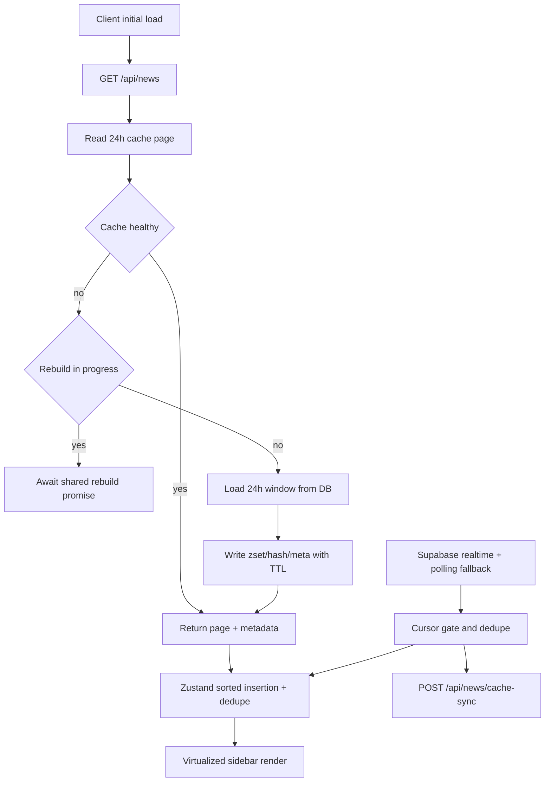

# Beacon - Real-Time Global News Dashboard

Beacon is a production-grade real-time news dashboard with an interactive globe, high-volume article stream rendering, progressive loading, and Redis-backed caching.

## What Beacon Does

- Visualizes global news activity on an interactive globe.
- Streams and surfaces newly arriving articles in real time.
- Maintains strict chronological ordering (`published_at DESC`) across initial load, background pagination, and realtime inserts.
- Supports large 24-hour article windows (hundreds to thousands of records) without blocking the UI.

## Core Features

### News Feed and Loading

- **Instant first page + progressive background fill**: Fetches first 50 immediately, then continues fetching paginated 50-row batches in the background.
- **Virtualized article list**: Uses `@tanstack/react-virtual` so only visible rows render.
- **Consistent sorted store**: All article writes flow through a single Zustand sorted insertion path with deduplication.
- **Realtime injection with new-badge UX**: New articles are cursor-gated (`published_at > lastKnownMaxPublishedAt`) and marked with a temporary `NEW` indicator.
- **Footer loading status**: Shows `Loading X/N` while background fill is active.

### Caching and Performance

- **Redis-backed 24h cache window**:
  - Sorted set for ordering and pagination by timestamp.
  - Hash payload store for article bodies.
  - Metadata key for count, freshness, and cursor info.
- **Upstash + Redis URL support**:
  - Uses Upstash REST when `UPSTASH_REDIS_REST_URL` and `UPSTASH_REDIS_REST_TOKEN` exist.
  - Uses standard Redis client when `REDIS_URL` is provided.
  - Falls back gracefully to in-memory behavior when Redis is unavailable.
- **Singleflight rebuild guard**: Prevents concurrent cache rebuild storms when cache recovery is needed.
- **Incremental cache sync**: Realtime articles are inserted into cache without full invalidation.

### Search and Filtering

- **Search filters article panel**
- **Multi-dimension filters**: source, category, bias, sentiment, urgency, date range, and locations.
- **Globe-to-filter integration**: Pin/location interactions flow into location filtering.

### UI and Mobile UX

- **Single-frame mobile viewport** (`100dvh`) with safe-area aware controls.
- **Mobile sidebar behavior**: Tapping an article closes sidebar first, then globe animation and drawer flow continue.
- **Compact, consistent article spacing** with measured virtual rows.
- **Centered globe control pill** optimized for small screens.

### Category Taxonomy (Expanded)

Beacon supports expanded article categories:

- `politics`
- `economy`
- `technology`
- `health`
- `conflict`
- `sports`
- `science`
- `environment`
- `crime`
- `education`
- `entertainment`

## Architecture Overview



## Tech Stack

- **Framework**: Next.js 16 (App Router) + TypeScript
- **State**: Zustand
- **Styling**: Tailwind CSS 4
- **Animation**: Framer Motion
- **Virtualization**: `@tanstack/react-virtual`
- **Data**: Supabase (DB + realtime + edge functions)
- **Cache**: Upstash Redis / Redis URL adapter
- **UI primitives**: shadcn/ui + Radix

## API Surface

- `GET /api/news`
  - Query: `offset`, `limit`, `hoursBack`, `forceRefresh`
  - Returns: `articles`, `totalCount`, `hasMore`, `nextOffset`, `cacheLayer`, `isStale`, `maxPublishedAt`
- `POST /api/news/refresh`
  - Forces a cache refresh path.
- `POST /api/news/cache-sync`
  - Incrementally syncs a specific article into cache.

## Environment Variables

### Required

- `NEXT_PUBLIC_SUPABASE_URL`
- `NEXT_PUBLIC_SUPABASE_ANON_KEY`

### Redis (choose one mode)

- **Upstash REST mode**
  - `UPSTASH_REDIS_REST_URL`
  - `UPSTASH_REDIS_REST_TOKEN`
- **Redis URL mode**
  - `REDIS_URL`

### Optional

- `NEWS_CACHE_TTL_SECONDS` (default: `600`)
- Provider API keys used by ingestion/edge pipelines (NewsAPI, GNews, etc.)

## Getting Started

```bash
npm install
npm run dev
```

Open [http://localhost:3000](http://localhost:3000).

Production:

```bash
npm run build
npm start
```

## Project Structure

```text
src/
  app/
    api/news/                # News, refresh, cache-sync routes
    page.tsx                 # Main dashboard shell
  components/
    globe/                   # Globe, controls, map integration
    news/                    # Sidebar, cards, drawer, skeletons
    search/                  # Search + filter controls
  hooks/
    use-realtime-news.ts     # Loading lifecycle orchestration
  stores/
    news-store.ts            # Sorted insertion + dedupe source of truth
  lib/
    news-service.ts          # Server-side page retrieval + cache strategy
    cache/
      article-cache.ts       # Cache window operations
      redis-client.ts        # Upstash/Redis adapter layer
```

## Operational Notes

- If Redis is down/misconfigured, Beacon falls back to DB/in-memory behavior instead of hard failing.
- Cache health checks are built in to avoid serving corrupted/empty pages with non-zero counts.

## License

MIT
